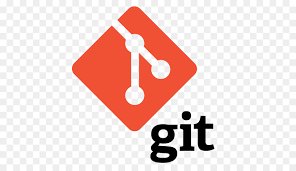

# O Que é Git?

### Agora que você sabe o que é GitHub, temos que entender que o Git é o coração do GitHub. Git é um sistema de controle de versão desenvolvido por Linus Torvalds (o criador do Linux).

### Isso significa que qualquer desenvolvedor numa equipe pode gerenciar o código-fonte e seu histórico de mudanças usando ferramentas de linha de comandos de Git – desde que tenha sido concedido o acesso para isso, é claro.

### Diferentemente dos sistemas de controle de versão centralizados, o Git oferece ramificações de recursos (ou feature branches). Isso significa que cada engenheiro de software na equipe pode separar uma ramificação de recursos que oferece um repositório local isolado para promover mudanças nos códigos.

### Feature branches não afetam a ramificação principal, que é onde o código original do projeto está localizado. Uma vez que as mudanças tenham sido feitas e o código atualizado está pronto, a ramificação pode ser misturada (num processo de merge) com o master branch. É assim que as mudanças no projeto se tornam efetivas.

 

# GitHub

### O GitHub hospeda mais de 100 milhões de repositórios, com a maior parte deles sendo projetos de código aberto. Essa estatística mostra que o GitHub está entre os clientes de Git GUI mais populares, e também porque é usado por vários profissionais e grandes empresas, como a Hostinger.

### Isso acontece porque o GitHub é um projeto de gestão baseado em nuvem e uma plataforma de organização que incorpora os recursos de controle de versão do Git. Isso significa que todos os usuários do GitHub podem acompanhar e gerenciar as mudanças feitas para o código-fonte em tempo real, enquanto têm acesso a todos os outros recursos do Git disponíveis no mesmo lugar.

### Além disso, a interface de usuário do GitHub é mais amigável do que a do Git, fazendo com que seja mais acessível para pessoas que possuem pouco ou nenhum conhecimento técnico. Isso significa mais membros de equipe podem ser incluídos no progresso e na gestão do projeto, fazendo com que o processo seja mais tranquilo.
